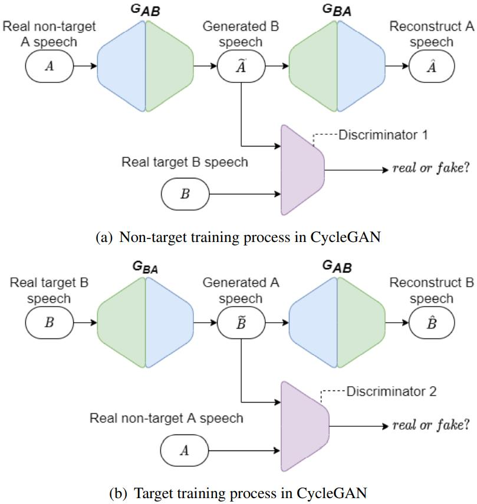
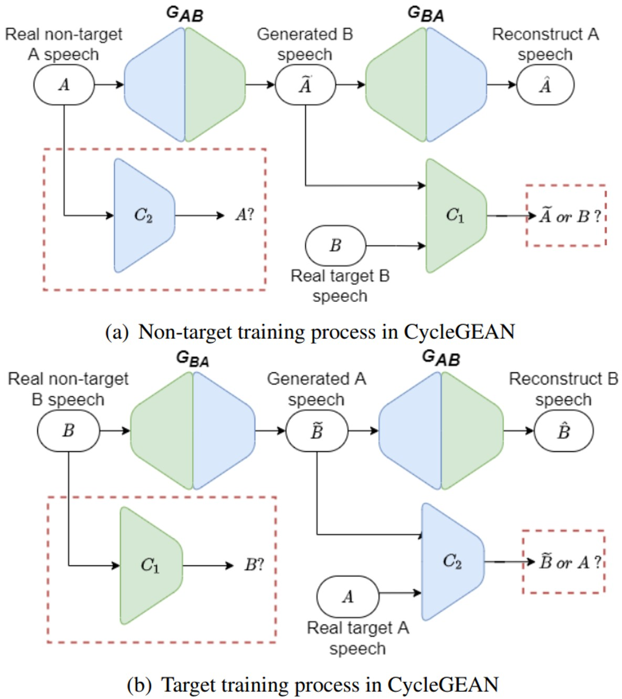

In this post, we show the demo of CYCLEGEAN: CYCLE GENERATIVE ENHANCED ADVERSARIAL NETWORK FOR VOICE CONVERSION

## Overview

Cycle Generative Adversarial Network (CycleGAN) for voice conversion (VC) task only used discriminators to identify whether the input voice is generated or real. It means the confrontational does not check the similarity with the target voice, leading the generated voice not much similar to the target. In this paper, instead of vocal checking,  we propose to enhance the confrontation to target similarity checking that addresses this problem. A Cycle Generative Enhanced Adversarial Network (CycleGEAN) was introduced to make the original two discriminators to target classifier and non-target classifier. The target classifier aims to identify whether the target speaks the input voice or not. Similarly, the non-target classifier identifies the non-target voice. Furthermore, we add a gradient reversal layer with different operations for target and non-target. Then in each GAN, we used both classifiers. One is the discriminator, and the other is trained for using in another GAN. In experiments, the proposed method compare to CycleGAN improves Mean Opinion Score (MOS) of 0.1 and Voice Similarity Score (VSS) of 0.2 on the Voice Conversion Challenge 2018 (VCC2018) dataset.

## Model Architecture
<!-- 

    
    

       
&nbsp;
 

Figure.1 The architecture of the CycleGEAN,
 -->

<table>
    <tr>
        <td >
 
</td>
        <td >
 
</td>
    </tr>
	<tr>
		<th> (A) CycleGAN-VC </th>
		<th> (B) CycleGEAN </th>
<!--         <td>(A) CycleGAN-VC 
</td>
        <td >(B) CycleGEAN 
 </td> -->
    </tr>

	
</table>

Figure.1 (A) The architecture of the CycleGAN-VC. (B) The architecture of the CycleGEAN.

<!-- ### General Digestive Metabolic Network

Figure.1 The architecture of the CycleGAN-VC.

### Functional Digestive Metabolic Network

Figure.2 The architecture of the CycleGEAN.
 -->

## Experiment
### Dataset
We carry out the experiments on a parallel-data-free dataset of VCC2018 dataset, which is recorded by professional US English speakers. We set the VCC2SF3 (SF1) and VCC2SM3 (SM1) as our source, VCC2TF2 (TF2) and VCC2TM2 (TM2) as our target, where S represents the source, T represents the target, F means female, M means male. By using the four speakers' speech, we set four tests, Female to Female (SF3-TF2),  Female to male (SF3-TM2), Male to Female (SM3-TF2), and Male to Male (SM3-TM2). We split the dataset into short sentences for all audio files of each speaker. These sentences are divided into two parts, 35 sentences as the evaluation dataset and 81 sentences as the training dataset. All speech data is sampling at 16000 Hz. There is no same content in the training and evaluation dataset to keep the non-parallel setting. When testing the transferred speech, we evaluate the similarity between original speech and transferred speech using the index on Voice Similarity Score (VSS) and the speech quality on Mean Opinion Score (MOS). 

### Results
In order to evaluate and show the performance of our model, we list the four Tables to respective show the four test, Table1, Table2, Table3 and Table4. 

&nbsp;
 

<table>
	<CAPTION>Table.1 The comparision between the CycleGEAN and other models on VCC2SF3-VCC2TF1</CAPTION>
    <tr>
        <th> ID </th>
		<th> Ground Truth</th>
        <th> CycleGAN-VC </th>
        <th> CycleGAN-VC2 </th>
		<th> CycleGEAN</th>
    </tr>
    <tr>
        <th> Sample 1 </th>
		<th> <audio controls id="player" onplay="pauseOthers(this);"><source src="assets/audios/Ground_Truth/SF3-TF1/30001.wav" type="audio/mpeg"></audio> </th>
        <th> <audio controls id="player" onplay="pauseOthers(this);"><source src="assets/audios/CycleGAN-VC/SF3-TF1/30001.wav" type="audio/mpeg"></audio> </th>
        <th> <audio controls id="player" onplay="pauseOthers(this);"><source src="assets/audios/CycleGAN-VC2/SF3-TF1/30001.wav" type="audio/mpeg"></audio> </th>
        <th> <audio controls id="player" onplay="pauseOthers(this);"><source src="assets/audios/CycleGEAN/SF3-TF1/30001.wav" type="audio/mpeg"></audio> </th>
    </tr>
	
	<tr>
        <th> Sample 2 </th>
		<th> <audio controls id="player" onplay="pauseOthers(this);"><source src="assets/audios/Ground_Truth/SF3-TF1/30002.wav" type="audio/mpeg"></audio> </th>
        <th> <audio controls id="player" onplay="pauseOthers(this);"><source src="assets/audios/CycleGAN-VC/SF3-TF1/30002.wav" type="audio/mpeg"></audio> </th>
        <th> <audio controls id="player" onplay="pauseOthers(this);"><source src="assets/audios/CycleGAN-VC2/SF3-TF1/30002.wav" type="audio/mpeg"></audio> </th>
        <th> <audio controls id="player" onplay="pauseOthers(this);"><source src="assets/audios/CycleGEAN/SF3-TF1/30002.wav" type="audio/mpeg"></audio> </th>
    </tr>
	
	
	<tr>
        <th> Sample 3 </th>
		<th> <audio controls id="player" onplay="pauseOthers(this);"><source src="assets/audios/Ground_Truth/SF3-TF1/30003.wav" type="audio/mpeg"></audio> </th>
        <th> <audio controls id="player" onplay="pauseOthers(this);"><source src="assets/audios/CycleGAN-VC/SF3-TF1/30003.wav" type="audio/mpeg"></audio> </th>
        <th> <audio controls id="player" onplay="pauseOthers(this);"><source src="assets/audios/CycleGAN-VC2/SF3-TF1/30003.wav" type="audio/mpeg"></audio> </th>
        <th> <audio controls id="player" onplay="pauseOthers(this);"><source src="assets/audios/CycleGEAN/SF3-TF1/30003.wav" type="audio/mpeg"></audio> </th>
    </tr>
	
</table>

&nbsp;
 

<table>
	<CAPTION>Table.2 The comparision between the CycleGEAN and other models on VCC2SF3-VCC2TM1</CAPTION>
    <tr>
        <th> ID </th>
		<th> Ground Truth</th>
        <th> CycleGAN-VC </th>
        <th> CycleGAN-VC2 </th>
		<th> CycleGEAN</th>
    </tr>
    <tr>
        <th> Sample 1 </th>
		<th> <audio controls id="player" onplay="pauseOthers(this);"><source src="assets/audios/Ground_Truth/SF3-TM1/30001.wav" type="audio/mpeg"></audio> </th>
        <th> <audio controls id="player" onplay="pauseOthers(this);"><source src="assets/audios/CycleGAN-VC/SF3-TM1/30001.wav" type="audio/mpeg"></audio> </th>
        <th> <audio controls id="player" onplay="pauseOthers(this);"><source src="assets/audios/CycleGAN-VC2/SF3-TM1/30001.wav" type="audio/mpeg"></audio> </th>
        <th> <audio controls id="player" onplay="pauseOthers(this);"><source src="assets/audios/CycleGEAN/SF3-TM1/30001.wav" type="audio/mpeg"></audio> </th>
    </tr>
	
	<tr>
        <th> Sample 2 </th>
		<th> <audio controls id="player" onplay="pauseOthers(this);"><source src="assets/audios/Ground_Truth/SF3-TM1/30002.wav" type="audio/mpeg"></audio> </th>
        <th> <audio controls id="player" onplay="pauseOthers(this);"><source src="assets/audios/CycleGAN-VC/SF3-TM1/30002.wav" type="audio/mpeg"></audio> </th>
        <th> <audio controls id="player" onplay="pauseOthers(this);"><source src="assets/audios/CycleGAN-VC2/SF3-TM1/30002.wav" type="audio/mpeg"></audio> </th>
        <th> <audio controls id="player" onplay="pauseOthers(this);"><source src="assets/audios/CycleGEAN/SF3-TM1/30002.wav" type="audio/mpeg"></audio> </th>
    </tr>
	
	
	<tr>
        <th> Sample 3 </th>
		<th> <audio controls id="player" onplay="pauseOthers(this);"><source src="assets/audios/Ground_Truth/SF3-TM1/30003.wav" type="audio/mpeg"></audio> </th>
        <th> <audio controls id="player" onplay="pauseOthers(this);"><source src="assets/audios/CycleGAN-VC/SF3-TM1/30003.wav" type="audio/mpeg"></audio> </th>
        <th> <audio controls id="player" onplay="pauseOthers(this);"><source src="assets/audios/CycleGAN-VC2/SF3-TM1/30003.wav" type="audio/mpeg"></audio> </th>
        <th> <audio controls id="player" onplay="pauseOthers(this);"><source src="assets/audios/CycleGEAN/SF3-TM1/30003.wav" type="audio/mpeg"></audio> </th>
    </tr>
	
</table>

&nbsp;
 

<table>
	<CAPTION>Table.3 The comparision between the CycleGEAN and other models on VCC2SM3-VCC2TF1</CAPTION>
    <tr>
        <th> ID </th>
		<th> Ground Truth</th>
        <th> CycleGAN-VC </th>
        <th> CycleGAN-VC2 </th>
		<th> CycleGEAN</th>
    </tr>
    <tr>
        <th> Sample 1 </th>
		<th> <audio controls id="player" onplay="pauseOthers(this);"><source src="assets/audios/Ground_Truth/SM3-TF1/30001.wav" type="audio/mpeg"></audio> </th>
        <th> <audio controls id="player" onplay="pauseOthers(this);"><source src="assets/audios/CycleGAN-VC/SM3-TF1/30001.wav" type="audio/mpeg"></audio> </th>
        <th> <audio controls id="player" onplay="pauseOthers(this);"><source src="assets/audios/CycleGAN-VC2/SM3-TF1/30001.wav" type="audio/mpeg"></audio> </th>
        <th> <audio controls id="player" onplay="pauseOthers(this);"><source src="assets/audios/CycleGEAN/SM3-TF1/30001.wav" type="audio/mpeg"></audio> </th>
    </tr>
	
	<tr>
        <th> Sample 2 </th>
		<th> <audio controls id="player" onplay="pauseOthers(this);"><source src="assets/audios/Ground_Truth/SM3-TF1/30002.wav" type="audio/mpeg"></audio> </th>
        <th> <audio controls id="player" onplay="pauseOthers(this);"><source src="assets/audios/CycleGAN-VC/SM3-TF1/30002.wav" type="audio/mpeg"></audio> </th>
        <th> <audio controls id="player" onplay="pauseOthers(this);"><source src="assets/audios/CycleGAN-VC2/SM3-TF1/30002.wav" type="audio/mpeg"></audio> </th>
        <th> <audio controls id="player" onplay="pauseOthers(this);"><source src="assets/audios/CycleGEAN/SM3-TF1/30002.wav" type="audio/mpeg"></audio> </th>
    </tr>
	
	
	<tr>
        <th> Sample 3 </th>
		<th> <audio controls id="player" onplay="pauseOthers(this);"><source src="assets/audios/Ground_Truth/SM3-TF1/30003.wav" type="audio/mpeg"></audio> </th>
        <th> <audio controls id="player" onplay="pauseOthers(this);"><source src="assets/audios/CycleGAN-VC/SM3-TF1/30003.wav" type="audio/mpeg"></audio> </th>
        <th> <audio controls id="player" onplay="pauseOthers(this);"><source src="assets/audios/CycleGAN-VC2/SM3-TF1/30003.wav" type="audio/mpeg"></audio> </th>
        <th> <audio controls id="player" onplay="pauseOthers(this);"><source src="assets/audios/CycleGEAN/SM3-TF1/30003.wav" type="audio/mpeg"></audio> </th>
    </tr>
	
</table>

&nbsp;
 

<table>
	<CAPTION>Table.4 The comparision between the CycleGEAN and other models on VCC2SM3-VCC2TM1</CAPTION>
    <tr>
        <th> ID </th>
		<th> Ground Truth</th>
        <th> CycleGAN-VC </th>
        <th> CycleGAN-VC2 </th>
		<th> CycleGEAN</th>
    </tr>
    <tr>
        <th> Sample 1 </th>
		<th> <audio controls id="player" onplay="pauseOthers(this);"><source src="assets/audios/Ground_Truth/SM3-TM1/30001.wav" type="audio/mpeg"></audio> </th>
        <th> <audio controls id="player" onplay="pauseOthers(this);"><source src="assets/audios/CycleGAN-VC/SM3-TM1/30001.wav" type="audio/mpeg"></audio> </th>
        <th> <audio controls id="player" onplay="pauseOthers(this);"><source src="assets/audios/CycleGAN-VC2/SM3-TM1/30001.wav" type="audio/mpeg"></audio> </th>
        <th> <audio controls id="player" onplay="pauseOthers(this);"><source src="assets/audios/CycleGEAN/SM3-TM1/30001.wav" type="audio/mpeg"></audio> </th>
    </tr>
	
	<tr>
        <th> Sample 2 </th>
		<th> <audio controls id="player" onplay="pauseOthers(this);"><source src="assets/audios/Ground_Truth/SM3-TM1/30002.wav" type="audio/mpeg"></audio> </th>
        <th> <audio controls id="player" onplay="pauseOthers(this);"><source src="assets/audios/CycleGAN-VC/SM3-TM1/30002.wav" type="audio/mpeg"></audio> </th>
        <th> <audio controls id="player" onplay="pauseOthers(this);"><source src="assets/audios/CycleGAN-VC2/SM3-TM1/30002.wav" type="audio/mpeg"></audio> </th>
        <th> <audio controls id="player" onplay="pauseOthers(this);"><source src="assets/audios/CycleGEAN/SM3-TM1/30002.wav" type="audio/mpeg"></audio> </th>
    </tr>
	
	
	<tr>
        <th> Sample 3 </th>
		<th> <audio controls id="player" onplay="pauseOthers(this);"><source src="assets/audios/Ground_Truth/SM3-TM1/30003.wav" type="audio/mpeg"></audio> </th>
        <th> <audio controls id="player" onplay="pauseOthers(this);"><source src="assets/audios/CycleGAN-VC/SM3-TM1/30003.wav" type="audio/mpeg"></audio> </th>
        <th> <audio controls id="player" onplay="pauseOthers(this);"><source src="assets/audios/CycleGAN-VC2/SM3-TM1/30003.wav" type="audio/mpeg"></audio> </th>
        <th> <audio controls id="player" onplay="pauseOthers(this);"><source src="assets/audios/CycleGEAN/SM3-TM1/30003.wav" type="audio/mpeg"></audio> </th>
    </tr>
	
</table>

